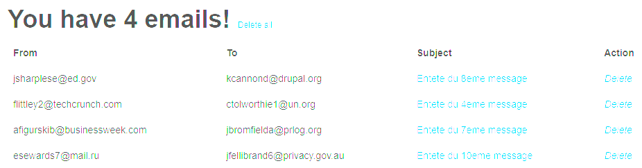

# DAI-2022-SMTP-Classe-B

#### Auteurs: Jalube Miguel, Gillet Paul
#### Date: 04.12.2022

### Breve description du projet

Cette application web permet d'envoyer des emails forgés et de les envoyer à une liste de personne en utilisant le protocole SMTP.
Par défaut l'application envoie les emails forgés à une liste de personne fictive via un serveur SMTP mocké. 
Mais il est tout a fait possible de changer les paramètres de l'application pour envoyer les emails à une liste de personne réelle via un serveur SMTP réel.

### Description de l'implémentation


Trois classes principales sont implémentées dans le projet :

ConfigManager : Cette classe permet de lire le fichier de configuration et de le parser. Les paramètres de configuration sont ensuite utilisés par les autres classes pour envoyer les emails.
PrankGenerator : Cette classe permet de générer des pranks en utilisant les données du fichier de configuration. Elle utilise la classe ConfigManager pour récupérer les paths des fichiers de victime et de prank.
SmtpClient : Cette classe permet d'envoyer les emails forgés à une liste de personne via un serveur SMTP. Utilise la classe ConfigManager pour récupérer les configurations du serveur SMTP nécessaire à l'envoie de mail.
    


### Instructions pour l'installation du serveur SMTP

Pour installer le serveur SMTP mocké, il faut tout d'abord installer Docker sur votre machine.
Une fois Docker installé, il faut lancer le serveur SMTP mocké en utilisant la commande suivante :
````agsl
docker run -p 8080:8282 -p 2525:25000 --rm mmoayyed/mockmock
````

S'il s'agit de la première fois l'image docker va être téléchargée, ce qui peut prendre un certain temps. 
Sinon elle va être lancée directement.

### Qu’est-ce qu'un serveur MockMock ? :

L'envoie automatique d'email à des utilisateurs est une fonctionnalité très commune à la plupart des applications web.
Cependant, il est parfois nécessaire pour le développeur de tester l'envoie de mail dans un environnement de
développement sans avoir à envoyer des mails à des utilisateurs réels.

C'est là qu'intervient MockMock, il s'agit d'un serveur SMTP dévloppé en Java qui une fois installé,
permet de simuler l'envoie de mail afin de voir à quoi ils ressemblent.
Il est possible grace à une interface web de voir les mails envoyés, leurs détails, etc....

Il fonctionne exactement comme un serveur SMTP classique à la seule différence qu'il ne les envoie pas mais les stocke dans une base de données.

### Instruction pour lancer le projet :

Cette application permet d'envoyer des emails forgés choisi aléatoirement à une liste de personnes données.

Il y a dans le dossier sourceFiles deux fichiers qui permettent de configurer les victimes et les messages que l'application va leur envoyer.

Il est important de respecter le format de ces fichiers à savoir :
- Le séparateur entre les différentes données est ';' et entre les différentes lignes un retour à la ligne.
- Pour le fichier des victimes : une victime par ligne, composé de la facon suivante : Prénom;Nom;Email
- Pour le fichier des messages : un message par ligne, composé de la facon suivante : Sujet;Corps du message

Dans le dossier configs, il y a un fichier de configuration qui permet de configurer l'application. 
Il est important de respecter l'ordre des paramètres et le format de ce fichier à savoir :
- Le séparateur utilisé dans les fichiers des victimes et des messages par défaut est ';'
- Le port du serveur SMTP par défaut est 2525
- L'adresse du serveur SMTP par défaut est localhost
- Le path du fichier des victimes par défaut est src/main/sourceFiles/victims.txt
- Le path du fichier des messages par défaut est src/main/sourceFiles/messages.txt
- Le nombre de groupes par défaut est 4
- Le nombre de personnes par groupe qui vont recevoir un email par défaut est 1

En utilisant la configuration par défaut, il est possible de lancer l'application à condition d'avoir installé Docker
et lancé le serveur MockMock.

Pour lancer le serveur MockMock, démarrer docker et lancer la commande suivante :
````agsl
docker run -p 8080:8282 -p 2525:25000 --rm mmoayyed/mockmock
````

Si il s'agit de la première fois l'image docker va d'abord être téléchargée, ce qui peut prendre un certain temps.
Sinon le serveur MockMock va démarrer et être accessible.

En ouvrant un navigateur et en allant sur l'adresse http://localhost:8080/, 
il est possible de voir les emails envoyés par l'application.

Si tout c'est bien déroulé, le résultat devrait être le suivant :



## References

* [Here is our fork of MockMock server](https://github.com/HEIGVD-Course-API/MockMock), in which we resolved an issues with a dependency (see this [pull request](https://github.com/tweakers/MockMock/pull/8) if you want to have more information).
* The [mailtrap](<https://mailtrap.io/>) online service for testing SMTP
* The [SMTP RFC](<https://tools.ietf.org/html/rfc5321#appendix-D>), and in particular the [example scenario](<https://tools.ietf.org/html/rfc5321#appendix-D>)
* Testing SMTP with TLS: `openssl s_client -connect smtp.mailtrap.io:2525 -starttls smtp -crlf`
